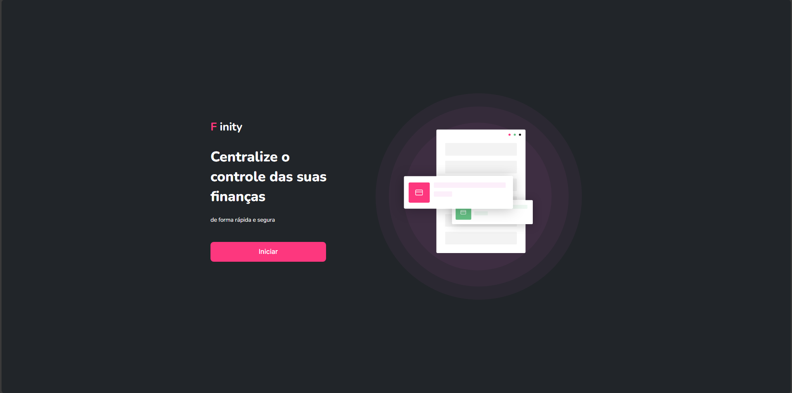

# Finity

https://finity-lake.vercel.app/



> A simple design for a financial control system.

---

### 📌 Technologies/Tools Used

- **Illustrator** – For vector creation
- **React** – UI framework

---

## 🚀 Installing and Running Finity

To install and run **Finity** on your machine, follow these steps:

### 🔹 1. Clone the Repository

```
git clone https://github.com/victorlgim/finity.git
```
```
cd finity
```

### 🔹 2. Install Dependencies

```
npm install
```

### 🔹 3. Start the Development Server

```
npm run dev
```

The application will be available at **http://localhost:3000**.

---

## 📝 License

This project is licensed. See the [LICENSE](LICENSE.md) file for more details.

